# File Operations Sequence Diagram

```mermaid
sequenceDiagram
    participant U as User
    participant FE as FileExplorer Component
    participant WS as WebSocket Client
    participant CG as ContainerGateway
    participant CMS as ContainerManagerService
    participant DC as Docker Container
    participant FS as Container Filesystem

    %% File Creation Flow
    Note over U, FS: File Creation Flow
    U->>FE: Click "Create File" or type filename
    FE->>FE: Show file creation dialog
    U->>FE: Enter filename and content
    FE->>WS: emit('fs-operation', { type: 'writeFile', path: '/workspace/app.js', contents: 'console.log("Hello")' })

    WS->>CG: fs-operation event
    CG->>CG: executeFileSystemOperation(containerId, operation)
    CG->>CG: Escape file contents: contents.replace(/'/g, "'\\''")
    CG->>CMS: executeCommand(containerId, "echo 'console.log(\"Hello\")' > /workspace/app.js")

    CMS->>CMS: Get Docker container from dockerContainers Map
    CMS->>DC: exec(['sh', '-c', "echo 'console.log(\"Hello\")' > /workspace/app.js"])
    DC->>FS: Write file to filesystem
    FS-->>DC: File written successfully
    DC-->>CMS: Command execution result
    CMS->>CMS: Parse Docker stream (8-byte headers)
    CMS-->>CG: { output: "", error: null }

    CG-->>WS: emit('fs-result', { operation: 'writeFile', result: { success: true, message: 'File created' } })
    WS-->>FE: File creation success
    FE->>FE: Refresh file explorer
    FE-->>U: Show new file in file tree

    %% File Reading Flow
    Note over U, FS: File Reading Flow
    U->>FE: Click on file in explorer
    FE->>WS: emit('fs-operation', { type: 'readFile', path: '/workspace/app.js' })

    WS->>CG: fs-operation event
    CG->>CG: executeFileSystemOperation(containerId, operation)
    CG->>CMS: executeCommand(containerId, "cat /workspace/app.js")

    CMS->>DC: exec(['sh', '-c', 'cat /workspace/app.js'])
    DC->>FS: Read file from filesystem
    FS-->>DC: File contents
    DC-->>CMS: stdout: "console.log(\"Hello\")"
    CMS->>CMS: Parse Docker stream
    CMS-->>CG: { output: "console.log(\"Hello\")" }

    CG-->>WS: emit('fs-result', { operation: 'readFile', result: { contents: "console.log(\"Hello\")" } })
    WS-->>FE: File contents received
    FE-->>U: Display file contents in editor

    %% Directory Listing Flow
    Note over U, FS: Directory Listing Flow
    U->>FE: Navigate to directory or refresh
    FE->>WS: emit('fs-operation', { type: 'readdir', path: '/workspace' })

    WS->>CG: fs-operation event
    CG->>CG: executeFileSystemOperation(containerId, operation)
    CG->>CMS: executeCommand(containerId, "ls -la /workspace | tail -n +2 | awk '{print $9, $1}' | grep -v \"^\\.$\" | grep -v \"^\\.\\.\\s\"")

    CMS->>DC: exec(['sh', '-c', 'ls -la /workspace | tail -n +2 ...'])
    DC->>FS: List directory contents
    FS-->>DC: Directory listing with permissions
    DC-->>CMS: stdout: "app.js -rw-r--r--\npackage.json -rw-r--r--\nnode_modules drwxr-xr-x"
    CMS-->>CG: { output: "app.js -rw-r--r--\n..." }

    CG->>CG: Parse ls output into files array
    loop For each line in output
        CG->>CG: Extract filename and permissions
        CG->>CG: Determine type: permissions.startsWith('d') ? 'directory' : 'file'
    end

    CG-->>WS: emit('fs-result', { operation: 'readdir', result: { files: [{ name: 'app.js', type: 'file' }, { name: 'node_modules', type: 'directory' }] } })
    WS-->>FE: Directory contents received
    FE-->>U: Update file explorer tree

    %% Directory Creation Flow
    Note over U, FS: Directory Creation Flow
    U->>FE: Right-click → "Create Folder"
    FE->>FE: Show folder creation dialog
    U->>FE: Enter folder name "src"
    FE->>WS: emit('fs-operation', { type: 'mkdir', path: '/workspace/src' })

    WS->>CG: fs-operation event
    CG->>CG: executeFileSystemOperation(containerId, operation)
    CG->>CMS: executeCommand(containerId, "mkdir -p /workspace/src")

    CMS->>DC: exec(['sh', '-c', 'mkdir -p /workspace/src'])
    DC->>FS: Create directory
    FS-->>DC: Directory created
    DC-->>CMS: Command success
    CMS-->>CG: { output: "" }

    CG-->>WS: emit('fs-result', { operation: 'mkdir', result: { success: true, message: 'Directory created' } })
    WS-->>FE: Directory creation success
    FE->>FE: Refresh parent directory
    FE-->>U: Show new folder in tree

    %% File Deletion Flow
    Note over U, FS: File Deletion Flow
    U->>FE: Right-click file → "Delete"
    FE->>FE: Show confirmation dialog
    U->>FE: Confirm deletion
    FE->>WS: emit('fs-operation', { type: 'rm', path: '/workspace/app.js' })

    WS->>CG: fs-operation event
    CG->>CG: executeFileSystemOperation(containerId, operation)
    CG->>CMS: executeCommand(containerId, "rm -rf /workspace/app.js")

    CMS->>DC: exec(['sh', '-c', 'rm -rf /workspace/app.js'])
    DC->>FS: Remove file
    FS-->>DC: File deleted
    DC-->>CMS: Command success
    CMS-->>CG: { output: "" }

    CG-->>WS: emit('fs-result', { operation: 'rm', result: { success: true, message: 'File deleted' } })
    WS-->>FE: Deletion success
    FE->>FE: Remove file from tree
    FE-->>U: File removed from explorer

    %% File Upload Flow
    Note over U, FS: File Upload Flow
    U->>FE: Drag & drop file or click upload
    FE->>FE: Read file content (base64 or text)
    FE->>WS: emit('file-upload', { filename: 'image.png', targetPath: '/workspace/assets/image.png', content: 'base64data...', encoding: 'base64' })

    WS->>CG: file-upload event
    CG->>CMS: uploadFileViaWebSocket(containerId, filename, targetPath, content, encoding)
    CMS->>CMS: Ensure target directory exists: "mkdir -p /workspace/assets"
    CMS->>DC: exec(['sh', '-c', 'mkdir -p /workspace/assets'])
    DC-->>CMS: Directory ready

    alt Binary File (base64)
        CMS->>CMS: Build command: "echo 'base64data...' | base64 -d > /workspace/assets/image.png"
    else Text File (utf8)
        CMS->>CMS: Escape content and build command: "echo 'escaped content' > /workspace/assets/file.txt"
    end

    CMS->>DC: exec(['sh', '-c', writeCommand])
    DC->>FS: Write uploaded file
    FS-->>DC: File written
    DC-->>CMS: Upload success
    CMS-->>CG: { success: true, path: '/workspace/assets/image.png' }

    CG-->>WS: Upload success response
    WS-->>FE: File uploaded successfully
    FE->>FE: Refresh directory
    FE-->>U: Show uploaded file in explorer

    %% Initial Container File Setup
    Note over U, FS: Initial Container File Setup (Boot Time)
    U->>FE: Create container with initial files
    FE->>CMS: createContainer({ files: fileSystemTree })
    CMS->>DC: Docker container started
    CMS->>CMS: writeFilesToContainer(container, files, '/workspace')

    loop For each file/directory in tree
        alt File Node
            CMS->>DC: exec(['mkdir', '-p', parentPath])
            CMS->>DC: exec(['sh', '-c', "echo 'file contents' > /workspace/filename"])
        else Directory Node
            CMS->>DC: exec(['mkdir', '-p', '/workspace/dirname'])
            CMS->>CMS: Recursively process subdirectory
        end
    end

    CMS-->>FE: Container ready with initial files
    FE-->>U: Container created with file structure

    %% Error Handling Flow
    Note over U, FS: Error Handling Flow
    U->>FE: Attempt invalid file operation
    FE->>WS: emit('fs-operation', { type: 'readFile', path: '/nonexistent/file.txt' })
    WS->>CG: fs-operation event
    CG->>CMS: executeCommand(containerId, "cat /nonexistent/file.txt")

    CMS->>DC: exec(['sh', '-c', 'cat /nonexistent/file.txt'])
    DC-->>CMS: stderr: "cat: can't open '/nonexistent/file.txt': No such file or directory"
    CMS-->>CG: { output: "", error: "cat: can't open..." }

    CG-->>WS: emit('error', { message: "cat: can't open...", operation: 'readFile' })
    WS-->>FE: Error received
    FE-->>U: Show error message in UI
```

## Key File Operation Patterns

### 1. **WebSocket-Based Operations**
- All file operations go through WebSocket for real-time feedback
- Operations are queued and processed sequentially
- Results/errors are emitted back to the client immediately

### 2. **Real Docker Command Execution**
- **Every file operation** executes actual Docker commands
- **No mock data** - all operations affect the real container filesystem
- Commands use shell escaping for safe content handling

### 3. **Shell Command Patterns**
- **Write File**: `echo 'escaped_content' > path`
- **Read File**: `cat path`
- **List Directory**: `ls -la path | tail -n +2 | awk '{print $9, $1}'`
- **Create Directory**: `mkdir -p path`
- **Delete**: `rm -rf path`

### 4. **Content Escaping**
- **Text Files**: Single quotes escaped as `'\''`
- **Binary Files**: Base64 encoded, then `| base64 -d > file`
- **Shell Safety**: All paths and contents properly escaped

### 5. **Stream Processing**
- **Docker Exec Streams**: 8-byte header parsing for stdout/stderr separation
- **Output Parsing**: Directory listings parsed into structured file objects
- **Error Detection**: stderr content properly captured and handled

### 6. **File Upload Handling**
- **Multiple Formats**: Supports both text (UTF-8) and binary (base64) uploads
- **Directory Creation**: Automatically creates parent directories
- **Large Files**: Streams handled efficiently through Docker exec

### 7. **Initial File Setup**
- **Boot Time**: Files can be written during container creation
- **Recursive Structure**: Supports nested directory structures
- **FileSystemTree**: Hierarchical file/directory representation

This design ensures that all file operations are real, persistent, and properly synchronized between the frontend file explorer and the actual container filesystem.