# Container Manager Service Architecture

```mermaid
graph TB
    %% User Layer
    USER[👤 User]

    %% Frontend Layer
    subgraph "Frontend Layer (Next.js - Port 3000)"
        UI[🖥️ User Interface]
        subgraph "React Components"
            CM[ContainerManager]
            FE[FileExplorer]
            TM[Terminal]
            FU[FileUploadPanel]
            TP[ThemeProvider]
        end
        subgraph "Client Libraries"
            CAPI[containerAPI]
            WAPI[webContainerAPI]
            WSC[ContainerWebSocket]
        end
    end

    %% Backend Layer
    subgraph "Backend Layer (NestJS - Port 3001)"
        subgraph "HTTP Controllers"
            CMC[🎯 ContainerManagerController<br/>Direct Container API]
            WCC[🔄 WebContainerController<br/>WebContainer Compatible API]
        end

        subgraph "WebSocket Gateway"
            CG[🔗 ContainerGateway<br/>Real-time Communication<br/>Namespace: /container]
        end

        subgraph "Core Service"
            CMS[⚙️ ContainerManagerService<br/>Docker Operations<br/>State Management]
        end

        subgraph "State Storage"
            MAPS[📊 In-Memory Maps<br/>• containers: UUID → ContainerInfo<br/>• dockerContainers: UUID → DockerID<br/>• containerWorkingDirs: UUID → Path<br/>• containerConnections: SocketID → UUID]
        end
    end

    %% Infrastructure Layer
    subgraph "Infrastructure Layer"
        DOCKER[🐳 Docker Engine<br/>Container Runtime]
        subgraph "Docker Containers"
            CONT1[📦 Container 1<br/>node:alpine<br/>Port: 8000+]
            CONT2[📦 Container 2<br/>node:alpine<br/>Port: 8001+]
            CONT3[📦 Container N<br/>node:alpine<br/>Port: 800N+]
        end
    end

    %% External Services
    subgraph "External Access"
        SWAGGER[📚 Swagger API Docs<br/>/api endpoint]
        PREVIEW[🌐 Container Preview URLs<br/>Dynamic ports]
    end

    %% Connections - User to Frontend
    USER --> UI
    UI --> CM
    UI --> FE
    UI --> TM
    UI --> FU

    %% Frontend Internal Connections
    CM --> CAPI
    CM --> WAPI
    FE --> WSC
    TM --> WSC
    FU --> WSC

    %% Frontend to Backend - HTTP
    CAPI -->|REST API<br/>Container Management| CMC
    WAPI -->|REST API<br/>WebContainer Compatible| WCC

    %% Frontend to Backend - WebSocket
    WSC -->|WebSocket<br/>Real-time Operations| CG

    %% Backend Internal Connections
    CMC --> CMS
    WCC --> CMS
    CG --> CMS

    %% Service to State
    CMS --> MAPS
    CG --> MAPS

    %% Backend to Infrastructure
    CMS -->|Docker API<br/>dockerode| DOCKER
    DOCKER --> CONT1
    DOCKER --> CONT2
    DOCKER --> CONT3

    %% External Access
    USER --> SWAGGER
    USER --> PREVIEW

    %% Data Flow Annotations
    CMS -.->|Port Assignment<br/>8000 + random| CONT1
    CMS -.->|File Operations<br/>exec commands| CONT1
    CG -.->|Terminal Sessions<br/>Working Directory| CONT1

    %% Styling
    classDef userLayer fill:#ff9999,stroke:#333,stroke-width:2px
    classDef frontendLayer fill:#99ccff,stroke:#333,stroke-width:2px
    classDef backendLayer fill:#99ff99,stroke:#333,stroke-width:2px
    classDef infraLayer fill:#ffcc99,stroke:#333,stroke-width:2px
    classDef externalLayer fill:#cc99ff,stroke:#333,stroke-width:2px
    classDef stateLayer fill:#ffff99,stroke:#333,stroke-width:2px

    class USER userLayer
    class UI,CM,FE,TM,FU,TP,CAPI,WAPI,WSC frontendLayer
    class CMC,WCC,CG,CMS backendLayer
    class DOCKER,CONT1,CONT2,CONT3 infraLayer
    class SWAGGER,PREVIEW externalLayer
    class MAPS stateLayer
```

## Service Responsibilities

### 🎯 **ContainerManagerController**
- **Purpose**: Direct container management API
- **Endpoints**: `GET|POST /containers`, `GET|DELETE /containers/:id`
- **Responsibilities**: Container CRUD operations, status management
- **Communication**: HTTP REST API

### 🔄 **WebContainerController**
- **Purpose**: WebContainer-compatible migration API
- **Endpoints**: `/webcontainer/boot`, `/webcontainer/:id/fs/*`, `/webcontainer/:id/spawn`
- **Responsibilities**: Provide familiar WebContainer API surface
- **Communication**: HTTP REST API

### 🔗 **ContainerGateway**
- **Purpose**: Real-time container interactions
- **Namespace**: `/container`
- **Events**: `join-container`, `fs-operation`, `process-operation`, `terminal-input`
- **Responsibilities**: WebSocket management, terminal sessions, working directory persistence
- **Communication**: WebSocket

### ⚙️ **ContainerManagerService**
- **Purpose**: Core Docker operations and state management
- **Responsibilities**:
  - Docker container lifecycle (create, start, stop, remove)
  - File system operations via Docker exec
  - Stream parsing (8-byte header handling)
  - State management across three Maps
- **Communication**: Docker API via dockerode

## Architecture Patterns

### 🏗️ **Layered Architecture**
- **Frontend Layer**: React components and API clients
- **Backend Layer**: NestJS controllers, gateways, and services
- **Infrastructure Layer**: Docker engine and containers

### 🔄 **Dual API Strategy**
- **Direct API**: Full container control for advanced use cases
- **Compatible API**: WebContainer migration path for existing applications
- **Shared Service**: Both APIs use the same ContainerManagerService

### 📊 **State Management**
- **Distributed State**: Multiple Maps across services
- **Coordinated Cleanup**: Services coordinate state cleanup on container deletion
- **Persistent Sessions**: Working directory state survives WebSocket reconnections

### 🌐 **Communication Patterns**
- **HTTP REST**: Initial container setup and management
- **WebSocket**: Real-time operations (file system, terminal, processes)
- **Docker API**: All container operations via dockerode library

### 🔒 **Security & Isolation**
- **Container Isolation**: Docker namespaces and cgroups
- **Resource Limits**: 512MB memory, 512 CPU shares per container
- **CORS Configuration**: Development-friendly CORS with credentials
- **Shell Escaping**: Proper escaping for file contents in commands