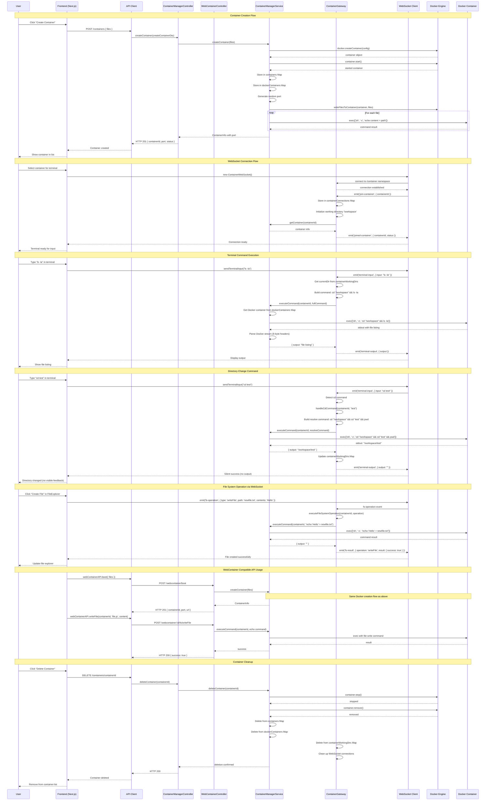

# Container Manager Service Interactions - Sequence Diagram

## Key Interaction Patterns

### 1. **State Management Across Services**
- **ContainerManagerService**: Manages `containers` and `dockerContainers` Maps
- **ContainerGateway**: Manages `containerConnections` and `containerWorkingDirs` Maps
- **Coordinated Cleanup**: Both services clean their respective state on container deletion

### 2. **Docker Command Execution**
- **All operations** go through `ContainerManagerService.executeCommand()`
- **Real Docker exec**: Every command executes in actual Docker containers
- **Stream Parsing**: 8-byte headers properly parsed for stdout/stderr

### 3. **Working Directory Persistence**
- **cd commands** specially handled by `ContainerGateway.handleCdCommand()`
- **State persistence** across WebSocket connections
- **Command prefixing** with current directory for all subsequent commands

### 4. **Dual API Support**
- **Direct API**: Full container control via ContainerManagerController
- **WebContainer API**: Migration-compatible endpoints via WebContainerController
- **Shared Backend**: Both use same ContainerManagerService for Docker operations

### 5. **Error Handling Flow**
- **Docker errors** bubble up through service layer
- **HTTP status codes** properly set (404 for not found, 500 for Docker errors)
- **WebSocket errors** emitted as events to connected clients